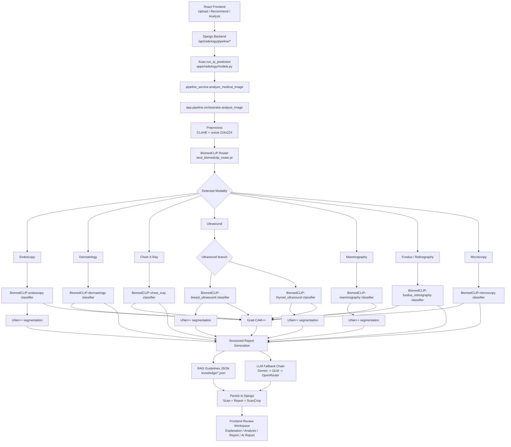

# Pipeline Flow Diagram

This document shows the complete Radisist pipeline as it runs today through the Django backend.

## One-Line Summary

The React frontend calls Django, Django calls the shared pipeline code, and Django stores the final routing, classification, segmentation, heatmap, audit trail, and AI report in the `Scan` and `Report` models.

## End-to-End Diagram

## Model Inventory

| Stage | Implementation | Model / Family | Notes |
|---|---|---|---|
| Preprocessing | `app.pipeline.preprocessing` | CLAHE + resize | Applied before routing/classification |
| Modality router | `app.models.router.BiomedCLIPRouter` | `best_biomedclip_router.pt` | Uses BiomedCLIP backbone |
| Classifier backbone | `app.models.classifier.BiomedCLIPClassifier` | `microsoft/BiomedCLIP-PubMedBERT_256-vit_base_patch16_224` | Shared classifier architecture |
| Endoscopy classifier | `DiseaseClassifier` | `models/disease_models/endoscopy/classification/best_classifier.pt` | 4 classes |
| Dermatology classifier | `DiseaseClassifier` | `models/disease_models/dermatology/classification/best_classifier.pt` | malignant / non_malignant |
| Chest X-Ray classifier | `DiseaseClassifier` | `models/disease_models/chest_xray/classification/best_classifier.pt` | multilabel |
| Breast ultrasound classifier | `DiseaseClassifier` | `models/disease_models/breast_ultrasound/classification/best_classifier.pt` | benign / malignant / normal |
| Mammography classifier | `DiseaseClassifier` | `models/disease_models/mammography/classification/best_classifier.pt` | BENIGN / MALIGNANT |
| Thyroid ultrasound classifier | `DiseaseClassifier` | `models/disease_models/thyroid_ultrasound/classification/best_classifier.pt` | low_risk / suspicious |
| Fundus classifier | `DiseaseClassifier` | `models/disease_models/fundus_retinography/classification/best_classifier.pt` | retinal disease routing |
| Microscopy classifier | `DiseaseClassifier` | `models/disease_models/microscopy/classification/best_classifier.pt` | metastasis / no_metastasis |
| Segmentor family | `app.models.segmentor.DiseaseSegmentor` | `segmentation_models_pytorch.UnetPlusPlus` | Used when segmentation exists |
| Endoscopy segmentor | `DiseaseSegmentor` | `models/disease_models/endoscopy/segmentation/best_segmenter.pt` | optional segmentation branch |
| Breast ultrasound segmentor | `DiseaseSegmentor` | `models/disease_models/breast_ultrasound/segmentation/best_segmenter.pt` | optional segmentation branch |
| Mammography segmentor | `DiseaseSegmentor` | `models/disease_models/mammography/segmentation/best_segmenter.pt` | optional segmentation branch |
| Thyroid ultrasound segmentor | `DiseaseSegmentor` | `models/disease_models/thyroid_ultrasound/segmentation/best_segmenter.pt` | optional segmentation branch |
| Explainability | `app.pipeline.xai.generate_gradcam` | Grad-CAM++ | Heatmap output |
| Report engine | `app.pipeline.report.generate_report` | RAG + LLM | Uses guideline JSON + provider fallback |
| LLM provider 1 | `app.llm.provider` | Gemini 2.5 Flash | first fallback target |
| LLM provider 2 | `app.llm.provider` | GLM 4.5 Flash | second fallback target |
| LLM provider 3 | `app.llm.provider` | OpenRouter model from env | third fallback target |

## Modality To Disease Mapping

| Router Output | Disease Model(s) |
|---|---|
| Endoscopy | `endoscopy` |
| Dermatology | `dermatology` |
| X-Ray | `chest_xray` |
| Ultrasound | `breast_ultrasound`, `thyroid_ultrasound` |
| Mammography | `mammography` |
| Fundus / Retinography | `fundus_retinography` |
| Microscopy | `microscopy` |

## Django Execution Path

The integrated app uses this backend path:

1. Frontend calls `POST /api/radiology/pipeline/analyze/`
2. Django creates a `Scan`
3. `Scan.run_ai_prediction()` calls `pipeline_service.analyze_medical_image()`
4. Shared pipeline code runs:
   - router
   - disease classifier
   - optional segmentor
   - Grad-CAM++
   - guideline-backed report generation
5. Django stores:
   - routing result
   - classification result
   - segmentation result
   - segmentation overlay
   - heatmap
   - audit trail
   - report provider / report error
   - structured AI report

## Output Stored In Django

The pipeline output ends up in:

- `Scan`
  - routing fields
  - classification fields
  - segmentation payload
  - heatmap payload
  - audit trail
  - analysis metadata
- `Report`
  - summary impression
  - full structured report JSON
  - report provider
  - report error
- `ScanCrop`
  - image crops saved from the expand-image tool
